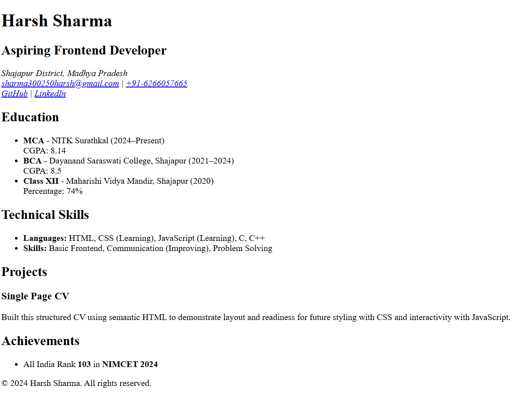

# Harsh Sharma – HTML CV Project

This is a single-page HTML CV created using semantic HTML. The project demonstrates the use of structured HTML elements, SEO meta tags, Open Graph tags for social media previews, and favicon integration. It is deployed using GitHub Pages.

## Project URL

Project URL: https://roadmap.sh/projects/single-page-cv

## Features

- Semantic HTML5 structure
- SEO meta tags
- Open Graph tags for social sharing
- Favicon support
- Responsive layout using viewport meta tag
- Hosted via GitHub Pages

## Technologies Used

- HTML
- Git & GitHub
- GitHub Pages
- Markdown (for README)

## Screenshot

## Contact

Email: sharma300250harsh@gmail.com  
LinkedIn: https://linkedin.com/in/harsh-sharma-518499227  
GitHub: https://github.com/harshcodes05
